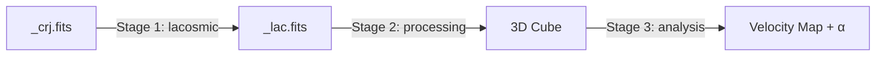

# stis_analysis

HST/STIS 分光データの宇宙線除去・処理・解析を行う統合パッケージ。

## 概要

`stis_analysis` は、Hubble Space Telescope (HST) の Space Telescope Imaging Spectrograph (STIS) で取得したデータを処理するモノレポです。以下の 3 つのステージで構成されています。



| Stage | 処理内容 | 入力 → 出力 |
|---|---|---|
| **1. lacosmic** | LA-Cosmic 宇宙線除去 | `_crj.fits` → `_lac.fits` |
| **2. processing** | stistools pipeline → 連続光差し引き → OIII λ4959 除去 → ±2500 km/s 切り取り → 6スリット→3D Cube → 空間補間 | `_lac.fits` → 3D Cube |
| **3. analysis** | Velocity Map 変換 + 追加処理 | 3D Cube → 解析結果 |

---

## パッケージ構成

```
stis_analysis/
├── src/stis_analysis/
│   ├── __init__.py
│   ├── core/                     ← 共通基盤
│   │   ├── __init__.py
│   │   ├── fits_reader.py        ← STISFitsReader, ReaderCollection
│   │   ├── instrument.py         ← InstrumentModel
│   │   └── image.py              ← ImageUnit (将来的に BaseImageModel)
│   │
│   ├── lacosmic/                 ← Stage 1 (stis_la_cosmic から移植)
│   │   ├── __init__.py
│   │   ├── image.py              ← ImageModel, ImageCollection
│   │   └── pipeline.py           ← LaCosmicPipeline, PipelineResult
│   │
│   └── processing/               ← Stage 2 (新規開発)
│       ├── __init__.py
│       └── (今後設計)
│
├── tests/
│   ├── test_core/
│   ├── test_lacosmic/
│   └── test_processing/
│
├── pyproject.toml
└── README.md
```

---

## 開発ロードマップ

### Phase 1: 基盤構築 (現在)
- [ ] `core/` の実装 — `STISFitsReader`, `ReaderCollection`, `InstrumentModel`, `ImageUnit`
- [ ] `lacosmic/` の移植 — `stis_la_cosmic` から import パスを書き換えて移行
- [ ] `lacosmic/` のテスト整備

### Phase 2: Stage 2 開発
- [ ] `processing/` サブパッケージの設計・実装
  - stistools pipeline 連携
  - 連続光差し引き
  - OIII λ4959 除去
  - ±2500 km/s 切り取り
  - 6スリット → 3D Cube 結合
  - 空間補間
- [ ] `processing/` のテスト整備

### Phase 3: Stage 3 開発
- [ ] `analysis/` サブパッケージの設計・実装
  - Velocity Map 生成
  - 追加解析処理
- [ ] `analysis/` のテスト整備

### Phase 4: `BaseImageModel` 抽出 (将来)
- [ ] `processing/` 安定後に `core/image.py` へ共通基底クラスを抽出

---

## インストール

```bash
# 基本インストール
pip install stis-analysis

# Stage 1 (LA-Cosmic) を使う場合
pip install "stis-analysis[lacosmic]"

# Stage 2 (processing) を使う場合
pip install "stis-analysis[processing]"

# 全機能
pip install "stis-analysis[all]"
```

> **開発環境:**
> ```bash
> git clone https://github.com/HisadaRintaro/stis_analysis.git
> cd stis_analysis
> poetry install --with dev
> ```

---

## 依存関係

```toml
[project.optional-dependencies]
lacosmic = ["lacosmic>=1.4.0"]
processing = ["stistools>=1.4.7", "scipy>=1.17.0"]
all = ["stis-analysis[lacosmic,processing]"]
```

---

## 既存リポジトリとの関係

| リポジトリ | 方針 |
|---|---|
| `stis_la_cosmic` | `stis_analysis.lacosmic` に統合。元リポジトリはアーカイブ予定 |
| `spectrum_package` | フロー変更のためアーカイブ。再利用可能な部品は `core/` に流用 |

---

## ライセンス

MIT License
